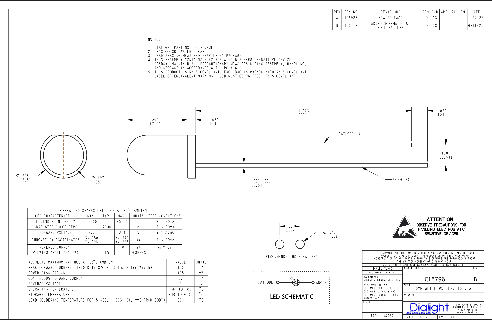
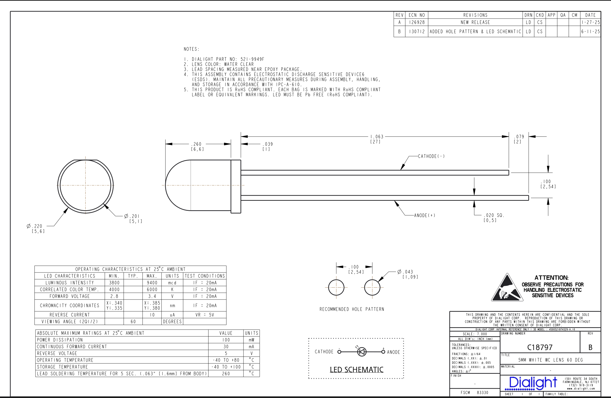

# FindMyScooter

Use the nRF54L15 to trigger light and sound effects via a smartphone BLE connection.

## Compile:

`ln -sf build/blinky_2/compile_commands.json compile_commands.json`

## Hardware

- nRF54L15 DK
- External Speaker
- LEDs (白色LED 5mm HI-INT WHITE WC 15deg)
- LEDS (白色LED 5mm WHITE WC Lens 60deg)
- Wires and Breadboard
- USB C to C for DK connection

## LEDs Schematic

### 白色LED 5mm HI-INT WHITE WC 15deg

### 白色LED 5mm WHITE WC Lens 60deg

